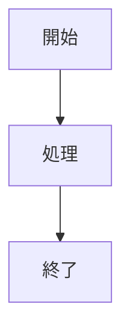
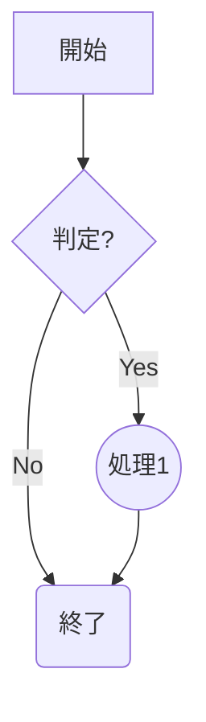
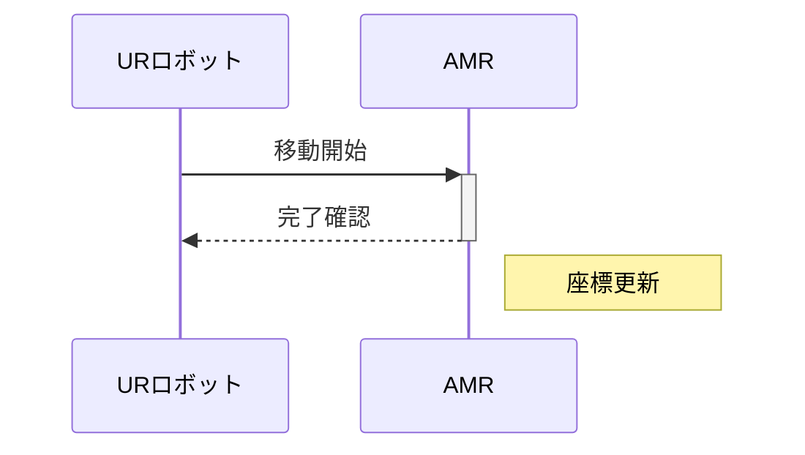
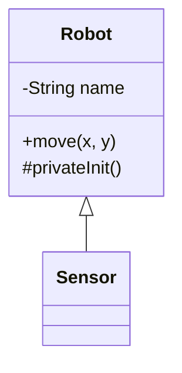

# I want to do follow the lists 

## Blender
+ laser expression
+ rig
  + UR5e動かしたい
+ 一部にデカール貼り
+ テクスチャ貼り
+ マテリアルに詳しくなりたい

## Sony Spressense IMU
+ 使いこなし？

## talk with AMR

## AMR predictable reaction

---
## Mermaid記法

- ノード形状: `A[矩形]` `A(丸角)` `A((円))` `A{Rhombus}`
- 矢印: `-->` (実線矢印) `---` (実線) `-.->` (点線)[2]

## シーケンス図（Sequence）
ロボット制御の流れなどに便利です。

